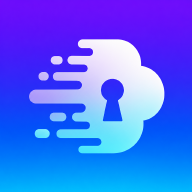

<!-- Improved compatibility of back to top link: See: https://github.com/othneildrew/Best-README-Template/pull/73 -->
<a id="readme-top"></a>

<!-- PROJECT SHIELDS -->
[![MIT License][license-shield]][license-url]
[![LinkedIn][linkedin-shield]][linkedin-url]

<!-- PROJECT LOGO -->
<br />
<div align="center">
  <a href="https://github.com/girishrv/Vapor">
    
  </a>

<h3 align="center">Vapor 💨</h3>

  <p align="center">
    Zero-Trust, Amnesiac Peer-to-Peer File Transfer Engine
    <br />
    <br />
    <a href="https://vapor-engine.web.app/">View Demo</a>
    &middot;
    <a href="https://github.com/girishrv/Vapor/issues/new?labels=bug">Report Bug</a>
    &middot;
    <a href="https://github.com/girishrv/Vapor/issues/new?labels=enhancement">Request Feature</a>
  </p>
</div>

<!-- TABLE OF CONTENTS -->
<details>
  <summary>Table of Contents</summary>
  <ol>
    <li>
      <a href="#about-the-project">About The Project</a>
      <ul>
        <li><a href="#built-with">Built With</a></li>
      </ul>
    </li>
    <li><a href="#security-architecture">Security Architecture</a></li>
    <li><a href="#how-it-works">How It Works</a></li>
    <li><a href="#features">Features</a></li>
    <li>
      <a href="#getting-started">Getting Started</a>
      <ul>
        <li><a href="#prerequisites">Prerequisites</a></li>
        <li><a href="#installation">Installation</a></li>
      </ul>
    </li>
    <li><a href="#usage">Usage</a></li>
    <li><a href="#license">License</a></li>
    <li><a href="#contact">Contact</a></li>
  </ol>
</details>

<!-- ABOUT THE PROJECT -->
## About The Project

Vapor is a cross-platform (iOS, Android, Web, Windows, macOS, Linux) file transfer application built with Flutter. It lets two or more devices exchange files directly over WebRTC, end-to-end encrypted, with no account, no server-side file storage, and no lasting trace once the session ends.

Vapor operates on a strict **Zero-Trust and Amnesiac** design architecture:

* **No Accounts:** No sign-ups, no user databases.
* **No History:** No transfer logs, no saved peers, no recent devices.
* **No Trace:** Temporary file buffers and cryptographic keys are aggressively purged the moment a transfer completes, aborts, or a panic wipe is triggered. The app starts completely fresh every session.
* **No Implicit Trust:** Every session derives a fresh, ephemeral encryption key via key exchange between the two peers. Neither the signaling layer nor any intermediary ever has access to the shared secret or the file contents — data is encrypted before it leaves the sender and only decryptable by the intended receiver.

<p align="right">(<a href="#readme-top">back to top</a>)</p>

### Built With

* [![Flutter][Flutter.dev]][Flutter-url]
* [![Dart][Dart.dev]][Dart-url]
* [![Firebase][Firebase.google.com]][Firebase-url]
* [![WebRTC][WebRTC.org]][WebRTC-url]

<p align="right">(<a href="#readme-top">back to top</a>)</p>

<!-- SECURITY ARCHITECTURE -->
## Security Architecture

Vapor's "Zero-Trust" claim is backed by a concrete cryptographic pipeline, not just a marketing label:

* **Key Exchange — X25519 ECDH:** Each session generates a fresh ephemeral key pair. Peers exchange public keys and derive a shared secret via X25519, which is then passed through HKDF-SHA256 (keyed with the room ID) to produce the session's AES key. The shared secret never touches the signaling layer.
* **Encryption — AES-256-GCM:** Every file chunk is encrypted individually with a unique nonce before being sent over the WebRTC data channel, providing both confidentiality and tamper detection (authenticated encryption).
* **Integrity — Merkle Tree Verification:** Chunk hashes are assembled into a Merkle tree. The receiver can verify any chunk against the tree root using a Merkle proof, catching corruption or tampering without needing to re-hash the entire file.
* **File Sanitization — Magic-Byte Inspection:** Incoming file headers are inspected for disguised executables (Windows PE, ELF, Mach-O, Java class files, shell scripts) and blocked before they're written to disk.
* **Duress Response — Panic Wipe:** A panic trigger overwrites all in-memory key material with cryptographically random bytes, tears down the WebRTC connection and signaling room, and purges native temp buffers — all without popups or a visible trace of what happened.

<p align="right">(<a href="#readme-top">back to top</a>)</p>

<!-- HOW IT WORKS -->
## How It Works

1. **Local-First Discovery:** On session start, the sender broadcasts via mDNS (`nsd` package) and hosts a local WebSocket beacon. If the receiver is on the same network, peers connect directly — no internet or Firebase round-trip required.
2. **Signaling Fallback:** If local discovery doesn't succeed (different networks, restrictive firewalls, etc.), Firebase Realtime Database is used purely as a relay for WebRTC offer/answer (SDP) and ICE candidates under a 6-digit room code. No file content or file metadata is ever written to Firebase, and the room is auto-purged on disconnect.
3. **Key Exchange:** Once peers are connected, they perform an X25519 ECDH exchange over the (already-established) channel to derive a shared AES-256 key unique to that session.
4. **Encrypted Transfer:** Files are split into 64 KB chunks, individually AES-GCM encrypted, and streamed over the WebRTC data channel. For multi-peer transfers, the Swarm Manager coordinates parallel data channels across peers, load-balanced by latency.
5. **Verification:** Each received chunk is checked against its Merkle proof and scanned for disguised executables before being written to disk (or OPFS on Web).
6. **Teardown:** On completion, disconnect, or panic trigger, keys are zeroed in memory, the signaling room is removed, and temp buffers are purged. Nothing persists.

<p align="right">(<a href="#readme-top">back to top</a>)</p>

<!-- FEATURES -->
## Features

* **Direct 1:1 Transfer** — Send/Receive workspace with 6-digit room codes and QR code scanning.
* **Swarm Mode** — N-to-N mesh transfers across multiple connected peers simultaneously.
* **Deep Links** — Join a transfer instantly via `vapor://` links.
* **Cross-Platform** — Native builds for iOS, Android, Windows, macOS, Linux, and Web.
* **Drag & Drop** — Desktop platforms support drag-and-drop file staging.
* **Background Transfers** — Android/iOS keep-alive service so transfers survive app backgrounding.
* **PIN Lock Screen** — Optional local PIN gate (SHA-256 hashed, stored only on-device).

<p align="right">(<a href="#readme-top">back to top</a>)</p>

<!-- GETTING STARTED -->
## Getting Started

To get a local copy up and running follow these simple steps.

### Prerequisites

* Flutter SDK (3.24+)
* A Firebase Project with Realtime Database enabled
* Firebase CLI

  ```sh
  npm install -g firebase-tools
  ```

### Installation

1. Clone the repo

   ```sh
   git clone https://github.com/girishrv/Vapor.git
   ```

2. Navigate to the project directory

   ```sh
   cd Vapor/apps/app
   ```

3. Install Flutter packages

   ```sh
   flutter pub get
   ```

4. Configure Firebase using the FlutterFire CLI

   ```sh
   flutterfire configure
   ```

5. Run the application

   ```sh
   flutter run
   ```

<p align="right">(<a href="#readme-top">back to top</a>)</p>

<!-- USAGE EXAMPLES -->
## Usage

Using Vapor is simple and requires no accounts or setup. Here is the standard workflow:

### Sending Files

1. Open Vapor and tap **Send Workspace**.
2. Share the generated 6-digit room code with your peer (or let them scan the QR code).
3. Select the files you wish to transfer. The transfer begins immediately once they connect.

### Receiving Files

1. Open Vapor and tap **Receive Inbox**.
2. Enter the 6-digit code provided by the sender, or simply click a `vapor://` deep link to join instantly.
3. Accept the incoming transfer request to begin downloading directly to your device.

<p align="right">(<a href="#readme-top">back to top</a>)</p>

<!-- LICENSE -->
## License

Distributed under the MIT License. See `LICENSE.txt` for more information.

<p align="right">(<a href="#readme-top">back to top</a>)</p>

<!-- CONTACT -->
## Contact

GIRISH R V - [LinkedIn](https://linkedin.com/in/girishrv05)

Project Link: [https://github.com/girishrv/Vapor](https://github.com/girishrv/Vapor)

<p align="right">(<a href="#readme-top">back to top</a>)</p>

<!-- MARKDOWN LINKS & IMAGES -->
[license-shield]: https://img.shields.io/badge/License-MIT-blue.svg?style=for-the-badge
[license-url]: https://github.com/girishrv/Vapor/blob/master/LICENSE.txt
[linkedin-shield]: https://img.shields.io/badge/-LinkedIn-black.svg?style=for-the-badge&logo=linkedin&colorB=555
[linkedin-url]: https://linkedin.com/in/girishrv05

[Flutter.dev]: https://img.shields.io/badge/Flutter-02569B?style=for-the-badge&logo=flutter&logoColor=white
[Flutter-url]: https://flutter.dev/
[Dart.dev]: https://img.shields.io/badge/Dart-0175C2?style=for-the-badge&logo=dart&logoColor=white
[Dart-url]: https://dart.dev/
[Firebase.google.com]: https://img.shields.io/badge/Firebase-FFCA28?style=for-the-badge&logo=firebase&logoColor=white
[Firebase-url]: https://firebase.google.com/
[WebRTC.org]: https://img.shields.io/badge/WebRTC-333333?style=for-the-badge&logo=webrtc&logoColor=white
[WebRTC-url]: https://webrtc.org/